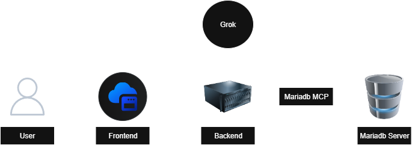

# Supozy AI

Supozy AI is an intelligent customer support system designed to automatically handle customer queries by leveraging an organization’s documentation and previously resolved support data. It enables faster, more accurate, and consistent responses, reducing manual workload while improving customer experience.

---

## Agents

### QueryAgent  
Responsible for handling user queries with semantic search. It retrieves the most relevant information from the vector store by matching queries against previously resolved tickets and documentation, ensuring accurate and context-aware responses.  

### EmbeddingAgent  
Responsible for generating vector embeddings for resolved tickets. These embeddings are stored in the vector store, enabling efficient semantic search and retrieval by the QueryAgent.  

---

## Installation & Setup

### Clone the repository

```bash
git clone
```

### Backend

#### Requirements

- Python 3.10
- uv [[install instructions](https://github.com/astral-sh/uv)]
- MariaDB server [[install instructions](https://github.com/MariaDB/mariadb-docker)]
- MariaDB MCP server [[install instructions](https://github.com/MariaDB/mcp)]

#### Install dependencies

```bash
uv sync
```

#### Create `.env` in the backend root as per `.env_template`

#### Run locally using

```bash
uvicorn main:app --reload
```

### Frontend

#### Requirements

- Node v22.14.0
- pnpm

#### Install dependencies

```bash
pnpm install
```

#### Create `.env` in the frontend root as per `.env_template`

#### Run locally using

```bash
pnpm run dev
```

---

## Database Schema

### users
| Column       | Type         | Constraints                                            | Description                   |
|--------------|--------------|--------------------------------------------------------|-------------------------------|
| id           | BINARY(16)   | PK                                                     | Unique user identifier (UUID) |
| email        | VARCHAR(255) | UNIQUE, NOT NULL                                       | User's email address          |
| name         | VARCHAR(100) | -                                                      | User's display name           |
| created_at   | DATETIME     | DEFAULT CURRENT_TIMESTAMP ON UPDATE CURRENT_TIMESTAMP  | Account creation timestamp    |

### conversations
| Column           | Type                              | Constraints                                            | Description                      |
|------------------|-----------------------------------|--------------------------------------------------------|----------------------------------|
| id               | BINARY(16)                        | PK                                                     | Unique conversation identifier   |
| user_id          | BINARY(16)                        | NOT NULL, FK → users(id)                               | Owner of the conversation        |
| status           | ENUM('active','closed','escalated') | DEFAULT 'active'                                     | Current conversation state       |
| started_at       | DATETIME                          | DEFAULT CURRENT_TIMESTAMP ON UPDATE CURRENT_TIMESTAMP  | When conversation began          |
| last_message_at  | DATETIME                          | DEFAULT CURRENT_TIMESTAMP ON UPDATE CURRENT_TIMESTAMP  | Timestamp of most recent message |

### messages
| Column          | Type      | Constraints                                            | Description                |
|-----------------|-----------|--------------------------------------------------------|----------------------------|
| id              | BIGINT    | PK, AUTO_INCREMENT                                     | Unique message identifier  |
| conversation_id | BINARY(16)| NOT NULL, FK → conversations(id) ON DELETE CASCADE     | Parent conversation        |
| sender          | ENUM('user','assistant') | NOT NULL                                | Who sent the message       |
| text            | TEXT      | NOT NULL                                               | Message content            |
| created_at      | DATETIME  | DEFAULT CURRENT_TIMESTAMP ON UPDATE CURRENT_TIMESTAMP  | When message was sent      |

### conversation_embeddings
| Column     | Type         | Constraints                                            | Description                         |
|------------|--------------|--------------------------------------------------------|-------------------------------------|
| id         | BIGINT       | PK, AUTO_INCREMENT                                     | Unique embedding identifier         |
| document   | TEXT         | NOT NULL                                               | Original text that was embedded     |
| embedding  | VECTOR(1024) | NOT NULL                                               | 1024-dimensional vector             |
| metadata   | JSON         | -                                                      | Additional context and tags         |
| created_at | DATETIME     | DEFAULT CURRENT_TIMESTAMP ON UPDATE CURRENT_TIMESTAMP  | When embedding was created          |

### Indexes
- **conversation_embeddings**: Vector index on `embedding` column using cosine distance

### Relationships

```
users(1) ──────> (n)conversations
conversations(1) ──────> (n)messages
```

---

## Architecture


